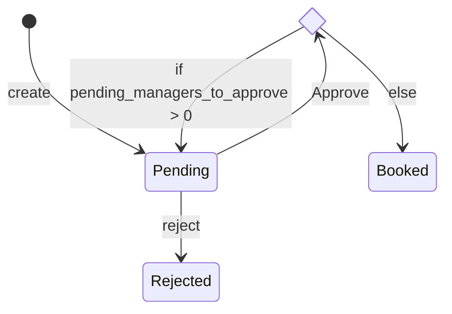
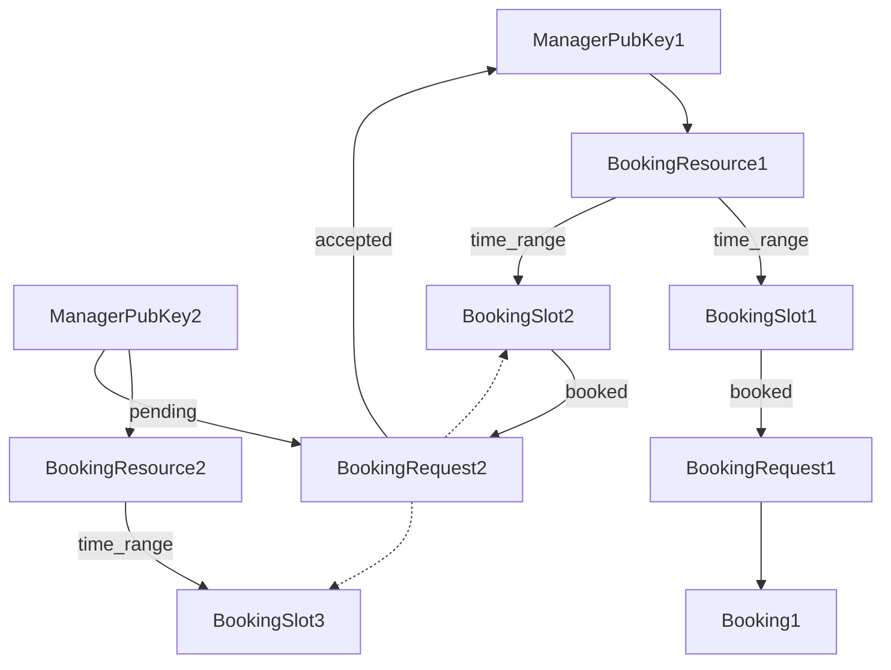

# Introduction >> Architecture ||20

The resoure booking module contains the following functionality and widgets.

## Functionality
This module has the functionality of:
* agent can **create an economic resource**
* agent can **add timeslots for each resource** when they are available for booking
* agent **editing the timeslots** for any resource they are managing
* agents can make **requests to book resources** that have been made available
* agents can **accept or decline requests** for bookings on resources that they manage (that they have created)
* agents can **view all bookings** for each resource
* agents can **view all bookings** they have made

  

## Diagrams

Key:
- Block: entry
- Black line: Link
- Dotted line: Reference by hash in entry

### State of a request

### Entry relationships

## Widgets
The following widgets are available to be integrated into your application:
* create resource dialogue
* incoming requests list
* view all bookings per resource view
* view all my bookings view (not yet implemented) 

## Future possibilities
Further implementation includes

* integration with **attestations** app to manage who gets to manage requests for a certain economic resource 
